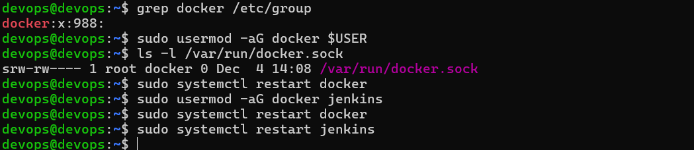
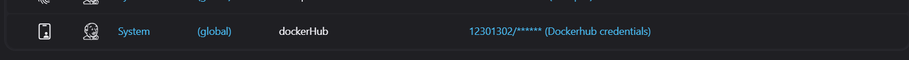

Vul onderstaande aan met de antwoorden op de vragen uit de readme.md file. Wil je de oplossingen file van opmaak voorzien? Gebruik dan [deze link](https://github.com/adam-p/markdown-here/wiki/Markdown-Cheatsheet) om informatie te krijgen over
opmaak met Markdown.

a)
zoals je hier boven kunt zien hebben we de user moeten toevoegen aan de docker group en jekins ook aan de docker group voor premissie te kunnen krijgen voor docker te kunnen runnen zodat alles kan builden

zoals je hier boven kunt zien hebben wij credentials moeten toevoegen om de pipeline te laten werken omdat die zonder credentials niet aan de docker hub gaan geraken
b)

Ik heb op de server apache moeten downloaden zodat je een curl kunt doen in de server zelf en van buitenaf, ik heb vooraf een fout dat er een conflict was als ik apache had gedownload met de docker dat poort 80 al in gebruik zat maar dan in de code in de jenkinsfile heb ik dit op poort 8081:80 gezet en toen werkte dit wel omdat het dan een curl kan doen en dat er geen conflict is met de poorten.
-Eerst heb ik op aws de server aangemaakt, ik heb gebruik gemaakt van een ubuntu linux zoals in de opdracht beschreven, ik heb wel nog manueel docker moeten downloaden op de server zodat dit werkt.
-Hierna heb ik ook in jenkins de private key meegegeven in jenkins met de id "ssh-key-id" zoals je in het deel "environment" kunt zien. 
-Als laatste heb ik de delen die ik moest maken in de opdracht in de Jenkinsfile gemaakt, "Deploy prod", "start prod", "Test Prod" en "cleanup" dit heeft uiteindelijk gewerkt.

